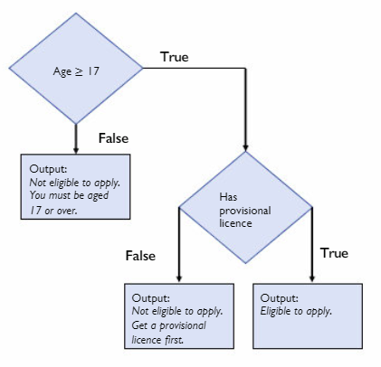

# Nested Conditionals 📚

Last year we looked at conditional statements like `if`, `elif` and `else`.

Now we are going to expand on these features and look at more complex use cases.

## Nested Conditional 📝
A conditional inside another is called a nested conditional, e.g. one `if` statemens _"nested"_ inside another.

## Task 1 - Driving Licence Application 👨🏽‍💻
We have previously looked at a version of programming this problem. Today however we will use a more complex version to demonstrate a _"nested if statement"._

The rules to be eligible to apply for a Driving Licence are as follows:

- If you are 17 or older & you have a provisional you may apply.
- If you are under 17, you are too young and may not apply.
- If you are 17 or over, but do not have a provisional licence, then you cannot apply.

## Flow Chart

Examine the FLow Chart below and use it to help think through the logic required to create your program.

In `main.py` create a program that will:

- Prompt the user to enter their age.
- Ask them if they have their Provisional Licence ``(Y / N)``.
- Output a suitable reply to the user based on the information they have provided.

## Taks 2 - Polluting Car Example 👨🏽‍💻
We have previously looked at `Boolean` Operators `and`, `or` and `not`.

We will now explore using them with conditionals.

In `main.py` create a program that will retreive and analyse the follwoing data input by a user.

- `carAge`
- `fuelType`

The criteria for determining the pollution level of a car are:

- If the car is 10 years old or more or is a diesel car, it has a high pollution level.
- Otherwise it has a low level of pollution.

## ✨ Extra Credit

- Can you go back to **_Task 1_** and modify your code to include `Boolean` operators where appropriate. 

  