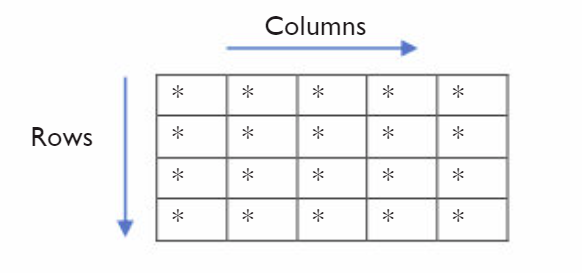
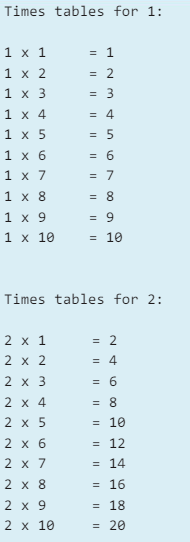

# Iteration - Nested Loops 📚

Last year in Chapter 1 we covered ``while`` and ``for`` Loops.

Today we are going to build on what we know about these loops and try to build
- A Grid Display
- Math Times Tables Display 

### 💡Note:

_This topic came up on the 2022 Section C - Programming Exam._

[Section C - 2022](https://www.examinations.ie/archive/exampapers/2022/LC219ALP040EV.pdf) 

## Task 1 - Grid Display (p190)

We can illustrate nested loops by displaying stars to output a grid.
Here is the code **_without_** using nested loops.

````py
print("*****")
print("*****")
print("*****")
print("*****")
````
Now, we can use nested loops to reduce the amount of code that we need to type.
Notice that the grid we are trying to display consists of `4 rows` and `5 columns`.



We can use two loops to create the rows and columns:
- one loop to generate the `5 columns`.
- the other loop to generate the `4 rows`.

### 🤔 Question to make you think?

- _Which loop should we create first... (think about how Python displays to the screen.)_


## Task 2.1 - Parson's Problem

Rearrange the code below to create a single row of 5 stars as shown in the following display:

````
Sample Display:

*****
````

Rearrange this code and add to `main.py` to create the display above.

- Remeber to add `# comments` to your code where necessary.
````py
for colIndex in range(cols):

print("*", end = "")

cols = 5
````

### 🤔 Question to make you think?

- What is the reason for adding...
````py
end = ""

````

## Task 2.2 - (4 x 5) Grid Display
We used the variable `cols` to represent the number of columns in the first row.

Now let's look at the `rows`, and using a `nested loop` try to create the following display.

````
*****
*****
*****
*****

````

<details>
<summary> 👀 Hint </summary>

````py
for rowIndex in range(rows):
````
  
</details>


## Task 3 - Math Times Tables Display 

Let's try to create a program to help young students with their Math Times Tables.

````
2 x 1 = 2
2 x 2 = 4
2 x 3 = 6
.   .   .
.   .   .
.   .   .
2 x 12 = 24
````

- Create a program that will output the display above.
- Add appropriate ``# comments`` to explain what your code does!

<details>
<summary> 👀 Hint </summary>

````py

answer = i * timesTable

for i in range(1,13):

timesTable = 2

print(timesTable, "x", i, "=", answer)
````
  
</details>


## Task 3.1



Now expanding on what you've just created, edit your code so it will display all Times Tables for numbers `1 - 12`.

 ### 💡Note:
 You will need to make use of **_Nested Loops._**


 