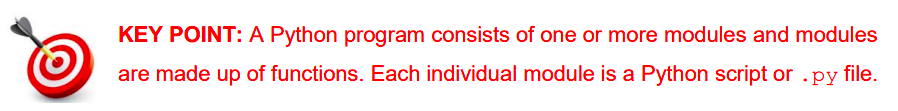

# Introduction to Functions 📚

Functions are the building blocks of programs. They allow programmers to organise their 
code into logically-related sections. 

The _‘art of computer programming’_ can be seen as a process of designing and creating 
individual functions and combining them together into larger units of code called modules. 
Over time, programmers combine these modules to produce the final program.

For the purpose of Leaving Certificate Computer Science (LCCS), a typical Python program 
might be made up of a single file that draws on and exploits the functionality made available 
by the standard library and, potentially, some other third party package(s). 

Most Python files are organised into three sections:

- the import statements _(typically at the top)_
- the function definitions _(by far the longest and most important section)_
- the main code _(i.e. the section from where the program execution begins)_



# Let's create some!
We're going to jump in and build some simple functions, in the next lesson we'll take a closer look at _user-defined_ vs _built-in_ functions.


## Steps 📝
  1. To define a function we use the python keyword ``def`` 
  2. The function below is called "greet".

     It says hello to people, type it up in `main.py` and run it yourself.
  ````py
  # create (define) your function
  
  def greet(name):
    print("Hello " + name + "!")
  ````

  3. By now you will have noticed that nothing happens. We must pass it some more information, in this case a variable called `name`.

Add the following lines...
  ````py
  # call the function while passing "Harry" into it
  greet("Harry")
  ````

## 💡Note: 
    
  - The function must be placed above where it is called.
  - Remember to indent the line beneath your function declaration.
  - Functions are a handy way to re-use code.
  - They are especially useful when you need to do the same thing in several different places in your program.
