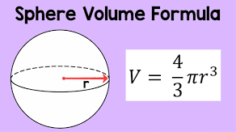

# Task 1 👨🏽‍💻

### Part A:
Write a function to calculate the Volume of a Sphere.



<details>
  <summary> Hint 👀 </summary>
  
  - Remember your function must have a meaningful name _(relevant to the operation it is performing)._
  - Does the function require any arguments _(variables that are passed to it)_?
  - Write the code body.
  - Does the function return anything? 
  
</details>

The sample code below will help you to get started.

````py
# Sample code
r = 10

volume = (4/3)*3.14*r**3

print(volume)
````

### Part B:
_Refactor_ the code to use a function that can print the Volume of a Sphere from a ``radius`` entered by the user.

_Refactoring is the process of restructuring code, while not changing its original functionality._

### Part C:

What if anything, have you noticed about the arguments you are passing to the function?
