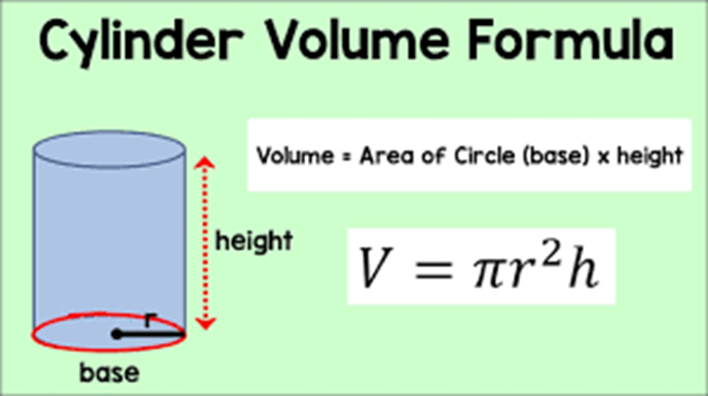

# Task 2 👨🏽‍💻

### Part A:
Write a function to calculate the Volume of a Cylinder.


To do this, we will need to create a functions with multiple arguments.

<details>
  <summary> Hint 👀 </summary>
  
  - Remember your function must have a meaningful name _(relevant to the operation(s) it is performing)._
  - Does the function require any arguments? _(to calculate the volume of a cylinder requires a radius and height)._
  - A function can take any number of arguments!
  - The arguments must be passed to the function in the correct order.
  - Write the code body.
  - Does the function return anything? 
  
</details>

The sample code below will help you to get started.

````py
# Sample code
h = 20
r = 7

vol = 3.14*(r**2)*h

print(vol)
````

### Part B:
_Refactor_ the code to use a function that can print the Volume of a Cylinder from a ``radius`` and ``height`` entered by the user.
