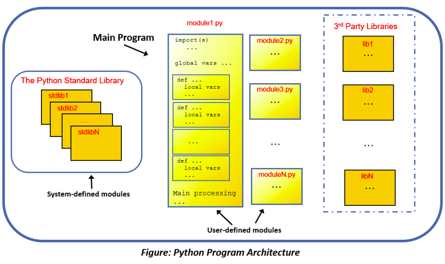
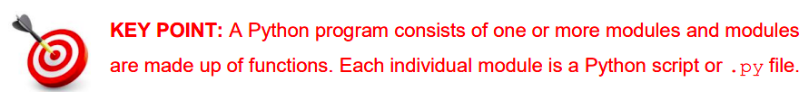

# Modular Programming using Functions 📚

Functions are the building blocks of programs. 

They allow programmers to organise their code into logically-related sections. In order to understand where functions fit into the overall scheme of things it is useful to have some understanding of the architecture of a Python program. 

This is depicted in the following illustration...

As can be seen a Python program is typically made up of many components. One of the key components is called a module.

- Modules can be thought of as individual Python script files 
(i.e. a file with a .py extension) made up mostly of functions.
- It is useful to think of a Python program as a collection of modules.
- At runtime, modules and functions co-operate with one another to achieve some desired result.
- Program execution starts in one special module called the _top level module_ which is also commonly referred to as the _‘main’_ program.

## Modules can be classified into three groups 📝

### - User-defined modules:

These are modules that are written by the programmer as part of the program which is being developed (aka the current development)

### - Standard library modules:

These are modules that come pre-installed as part of Python. The Python standard library is designed to save programmers from having to come up with their own solutions to common programming problems. As such, it comprises a full suite of off-the-shelf, ready to go solutions in the form of built-in functions.

_Some examples of Python libraries we have already come across are_ ``math``, ``random``, ``statistics``, and ``turtle``.

### - 3rd party modules: 

These are modules that are developed by an external source either for commercial purposes or as open source. 

There are literally thousands – some examples include ``tkinter``, ``numpy``, ``plotly``, ``scipy``, ``Django``, and ``flask``. 

The Python Package Index (PyPI) is a repository of software for the Python programming language.

So, modules and functions are constructs used by programmers to organise their code into separate units (or chunks). 

A _package_ is another such construct – it is used to group a number of related modules into a single entity. 
Conceptually, it is helpful to think of a package as a set of modules that reside on the file system in the same folder/directory.

## 💡Remember:

For the purpose of Leaving Certificate Computer Science (LCCS), a typical Python program might be made up of a single file that draws on and exploits the functionality made available by the standard library and, potentially, some other third party package(s). 

Most Python files are organised into three sections: 
- the import statements _(typically at the 
top)._
- the function definitions _(by far the longest and most important section)._
- the main code _(i.e. the section from where the program execution begins)._