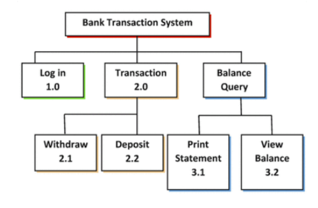

# User vs Built-in functions 📚 

Functions are very useful because they typically 
provide solutions to common programming problems _(e.g. display some text on the screen, read data from the end-user, send a tweet, process a cash withdrawal etc.)_ 

In certain cases, the programming problems are so common that Python provides a built-in function to do the job. Such functions are called _built-in functions._

In other cases, the problem to be solved is so specific to the program being developed that the programmer needs to design and write the code themselves. Such functions are called _user-defined functions._

## Benefits 
All functions, regardless of whether they are built-in or user-defined are given a name as part of their definition. The function name can then be used in a program to invoke the code contained in the function. 

We’ll examine the syntax and semantics of defining and invoking functions shortly but first 
let’s take a closer look at the two main reasons why functions are considered important:
1. They lead to modular systems.
2. They can be used to maximise code reuse and minimise code redundancy & duplicaton.
   
Large scale software systems are very often developed by breaking big problems down into smaller problems ``decomposition``. While designers and programmers are working on the detail of one part of the system they can ignore the rest of the system ``abstraction``.

Consider the functional decomposition diagram of an ATM/Bank Transaction system show below. 

The diagram shows the system broken down into a number of smaller sub-systems _(i.e decomposition)_. 

The functionality of each sub-system can be implemented using functions. This piece-by-piece approach to developing systems is sometimes called _divide and conquer_.

