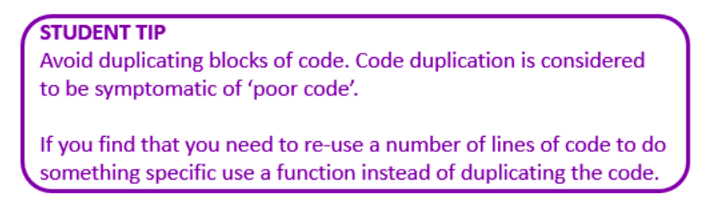

# Best of You - Song by Foo Fighters


````py
Lyrics:

print("I've got another confession to make")
print("I'm your fool")
print("Everyone's got their chains to break")
print("Holding you")

print("Is someone getting the best, the best, the best")
print("The best of you?")
print("Is someone getting the best, the best, the best")
print("The best of you?")

print("Are you gone and on to someone new?")
print("I needed somewhere to hang my head")
print("Without your noose")
print("You gave me something that I didn't have")
print("But had no use")

print("Is someone getting the best, the best, the best")
print("The best of you?")
print("Is someone getting the best, the best, the best")
print("The best of you?")

print("Has someone taken your faith?")
print("It's real, the pain you feel")
print("Your trust, you must confess")
print("Is someone getting the best, the best, the best")
print("The best of you?")
print("Oh")
print()
print("Oh, ho-oh")
print("Oh, oh-oh")
print("Oh, oh-oh")
print("Oh")

print("Has someone taken your faith?")
print("It's real, the pain you feel")
print("The life, the love you'd die to heal")
print("The hope that starts the broken hearts")
print("Your trust, you must confess")

print("Is someone getting the best, the best, the best")
print("The best of you?")
print("Is someone getting the best, the best, the best")
print("The best of you?")

print("I've got another confession, my friend")
print("I'm no fool")
print("I'm getting tired of starting again")
print("Somewhere new")

print("Is someone getting the best, the best, the best")
print("The best of you?")
print("Is someone getting the best, the best, the best")
print("The best of you?")

````

## Task 1 👨🏽‍💻 
Evaluate the song above by asking:
- Do you recognise any patterns?
- Is there any duplication / repetition?

Trying to avoid the duplication of lines of code and eliminating redundancy in the program, can you use the following functions `displayVerse1`, `displayVerse2`, `displayChorus` etc, to help to display the full song.

Example:
````py
def displayVerse1():
  print("I've got another confession to make")
  print("I'm your fool")
  print("Everyone's got their chains to break")
  print("Holding you")

````

<details>
<summary>
  Eliminating Redundancy 📝
</summary>
  In the context of programming, redundancy in code refers to the presence of duplicate or unnecessary elements, structures, or instructions that serve the same purpose. It leads to repetition and increases the size and complexity of the code without adding any significant value. 
  
Redundancy in code can be problematic for several reasons:

1. **Readability and Maintainability**:

   Redundant code makes it harder to read and understand the logic of the program. It can confuse developers and maintainers, especially when there are multiple copies of similar code scattered throughout the codebase. It also makes it more difficult to update or modify the code in the future, as changes may need to be applied in multiple places.

2. **Increased Code Size**:

   Redundancy increases the size of the code unnecessarily, making the program larger and potentially impacting performance. Larger code takes up more memory and may take longer to compile, leading to longer development and deployment times.

3. **Bug Prone**:

   When code is repeated, any bug or error in one instance of the code is likely to be repeated in other instances as well. Fixing the bug in one place might be missed in the other, leading to inconsistencies and hard-to-find bugs.

4. **Maintainability**:

   Redundancy makes it harder to maintain the codebase in the long term. When changes need to be made, they may need to be applied in multiple places, increasing the likelihood of introducing errors and inconsistencies.

To avoid redundancy in code, it is essential to follow good programming practices, such as using functions and methods to encapsulate reusable logic, using loops to avoid repetitive blocks of code, and applying the DRY (Don't Repeat Yourself) principle, which emphasizes writing code only once and reusing it where needed. 

Additionally, code reviews and refactoring can help identify and eliminate redundant code to improve the overall quality and maintainability of the program.

  
</details>

