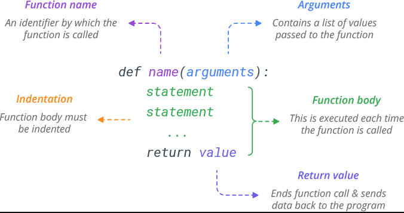

# Basic Function Syntax 📚

Once the ‘need’ for a function in your program has been recognised (the difficult bit!) the next step is to write the code. 

For this, we need to understand some syntax (the easy bit!).

Functions are made known to Python by writing a function definition `def`. 

In Python, the function definition is made up of two parts - a header and a body.
- the function header _(aka the function signature or prototype)_ is always the first line of the 
function definition
- the function body contains the Python statements required to carry out the work of the 
function.


### The function header - _(This is the very first line in the function definition)._

Every function header is composed of four separate parts:

1. The word ``def``: This is a Python keyword which tells Python to create a new function object. Every function must start with the def statement.
2. The function name: It is up to the programmer to decide what name to give a function. The rules for naming functions are the same as those for naming variables.
3. Brackets: These provide a mechanism for passing information into functions. 
4. Colon: The colon is used to terminate the function header. If the colon is omitted, Python will display a syntax error.

````py
def get_person():
 
````

### The function body
The body of every Python function consists of one or more Python statements. These statements combine to provide the function’s task. Although there is no limit to the number of statements that can be in a function body, it is generally considered good practice to keep functions short.

In Python, the statements inside a function body must always be indented. 
The function body ends when the indentation ends _(i.e. when the next statement appears at the same level of indentation as the def statement)._

````py
def get_person():
  person_name = input("What is your name?")    
  return person_name
````

### Calling a function
It is important to realise that the code inside a function body will not be executed unless the programmer explicitly requests it to be. The term for such a request is a function call. 

Functions can be called (or invoked) at runtime by writing the name of the function followed by brackets. The code to call the function `get_person` is shown below

````py
get_person()
````
This line calls the function `get_person`. Note, the brackets are needed but ``def`` and `:`colon are not.

When the above call is made the lines in the function body are executed thus causing the following to be displayed on the output console...

````
What is your name?
````

### Guidelines 📝 
Function names should be meaningful _i.e. they should in some way describe what the function does._ 

Since functions are usually actions, the name should contain at least one _verb._ 

If a function name is only one single word, the convention is to use lowercase; if the name of the function is made up of more than one word, the use of ``camelCase`` or ``under_score`` as a means of delimiting the words is considered good practice.

The basic syntax rules for naming functions are:
- A function name cannot be a Python keyword _(e.g. def, if, while, etc.)_
- Function names must contain only letters, digits, and the underscore character``_``.
- Function names cannot have a digit for the first character.

