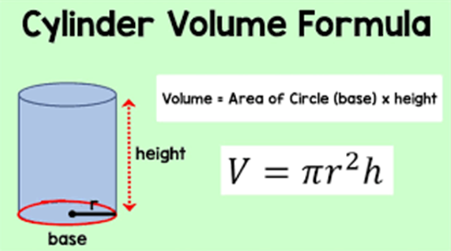

# Function Parameters & Arguments 📚 

Here is a simple function that will add two number together.

````py

def add_Numbers(param1, param2):
  return param1 + param2

add_Numbers(1,2)
````

- Parameters are the names you assign to the values inside the function definition.
  ````py
  param1, param2
  ````
- Arguments are the real values you pass to a function through an invocator _(i.e calling the function)._ They are outside the function definition.
  ````py
  1, 2
  ````


### Task 2 👨🏽‍💻 - Question to make you think 🤔

- Run this function, in `main.py`.
- Why isn't the sum of `1 + 2` shown in the console?

- Edit your function to display the sum of `param1 + param2`

>


## Volume of a Cylinder
 

Let's take a look back at our function from 7.1 - Intro to Functions.

````py
# Function parameters are r and h
def volOfCylinder(r, h):
  vol = 3.14*(r**2)*h
  print(vol)

# Arguments being passed to the function are 7 and 20
volOfCylinder(7, 20)
````

When the function `volOfCylinder` is called, Python performs two assignments:
- the value of `7` is assigned to the parameter `r`.
- the value of `20` is assigned to the parameter `h`.

## Task 3👨🏽‍💻 

- Run this function in `main.py` and see what output you get.
- What happens if you swap the order of the arguments?
- What happens if you pass a string `str` into the function instead of an integer `int` or decimal number`float`?


### 💡 Note:

- When more than one parameter is received by a function they are separated by commas `,`.

- Similarly, when more than one argument is passed into a function they are separated by commas `,`.

- Parameters are received into a function in the same order as the arguments provided.

- As a general guide the number of arguments provide should match the number of parameters provided for in the function header.