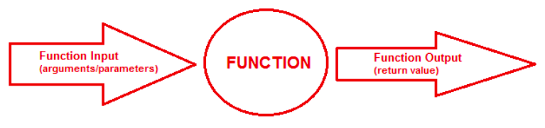

# Function Return Values 📚 

Functions can be thought of little machines (black box) that accept input(s) and produce output(s). 



In the previous section we learned that data can be passed into functions through the use of _arguments_ (at the function call) and _parameters_ (as part of the function header). 

In this section we explore the use of the ``return`` statement as a means to pass data out of a function.

# Combining Functions and Loops 📝
Let's take a look at the sample code below.

````py
# Add all the number from 0 to n

def sum_of_nums(n):
  total = 0

  for i in range(n+1):
    total = total + i

return total

sum_of_nums(10)   # Call the function
````

## PRIMM 🕵🏽‍♂️
1. Work with your classmates to _PREDICT_ what this program will do.
2. Type it up in `main.py` and test your predictions.
3. What does the code output?

## Task 1 👨🏽‍💻 
Again, working with your classmates, edit the code above to output the result of your function `sum_of_nums`.

<details>
  <summary> 👀 Hint </summary>
  The reason nothing appears to happen is that although the function is called and it does calculate and return the sum of the first 10 non-negative integers, the calling code takes no 
action to save or process the result.

>
The following code may help...

  ````py
  answer = sum_of_nums(10) # Call the function and ASSIGN the return value to answer
print("The sum of the first 10 integers is" , answer)
  ````
</details>

- We can now see that the value of `total` is passed out of the function and then assigned to the new variable `answer`.

### 💡Note:
When you want to save the return value of a function, the function call should be made as part of an assignment statement:

````
variable_name = function_call()
````
````py
answer = sum_of_nums(10)
````

## Function Composition 📝 
Alternatively, the programmer may decide there is no need to save the result of a function in a variable and process the result as part of the call. 

This type of _inline processing_ is shown below.

````py
# Add all the numbers from 0 to n
def sum_of_nums(n):
    total = 0
    
    for i in range(n+1):
        total = total + i

    return total

# Inline Processing
print("The sum of the first 10 integers is", sum_of_nums(10))
````
In this example the result of the function is not caught by the calling code. Rather, it is passed directly as an argument to ``print``. 

This technique is called _function composition._

In situations when functions are used directly as arguments to other functions, Python starts at the innermost function and works its way out _(i.e. the inner function is always evaluated first and evaluation continues from right to left)._

